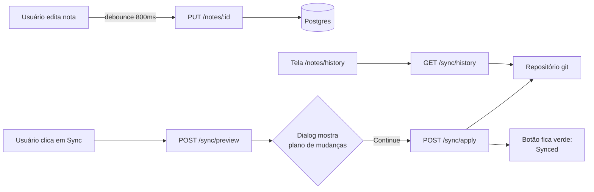

<p align="center">
  
</p>

<p align="center">
  
  
  
  
  
  
</p>

# Hub Pessoal — Frontend

Interface web do **Hub Pessoal**. Este repositório cobre o **Módulo 1 — Sincronização Central**: login, árvore de notas e pastas, editor markdown com auto-save, e o botão de sincronização com o repositório git de notas.

Construído em **Next.js 16** (App Router) + **React 19** + **TypeScript**, estilizado com **Tailwind CSS v4** sobre componentes headless do **Base UI** (estilo RetroUI). Deploy na **Vercel**.

## Sumário

- [Casos de uso](#casos-de-uso)
- [Fluxo do sistema — Notes](#fluxo-do-sistema--notes)
- [Uso das tecnologias](#uso-das-tecnologias)
- [Como rodar localmente](#como-rodar-localmente)
- [Como rodar os testes E2E](#como-rodar-os-testes-e2e)

## Casos de uso

- **Login** — autenticação contra a API, token guardado no cliente, sem cadastro público.
- **Árvore de notas e pastas** — criar, renomear, mover, apagar (bloqueado se a pasta não estiver vazia), fixar nota, duplicar, exportar `.md`.
- **Editor** — alternância entre modo de edição (markdown puro) e preview renderizado, com auto-save após pausa na digitação.
- **Sincronização** — botão de sync com estado visual (sincronizado, mudanças locais, mudanças remotas, divergente), dialog de confirmação mostrando o plano antes de aplicar, e uma tela de histórico de commits.

## Fluxo do sistema — Notes



O editor nunca fala com o git diretamente — toda mudança de conteúdo vai para o Postgres via API assim que o usuário para de digitar (auto-save). O botão de sync é a única ação que efetivamente materializa o banco em arquivos e conversa com o repositório remoto; por isso o dialog sempre mostra o plano (arquivos, `+inserções/-deleções`, mensagem de commit) antes de confirmar — nada é enviado ao GitHub sem essa confirmação explícita.

## Uso das tecnologias

| Tecnologia | Por quê |
| --- | --- |
| **Next.js 16 (App Router)** | Rotas por pastas (`app/(app)/notes/...`), o `(app)` isola o shell autenticado do `/login`. |
| **React 19** | Client components (`"use client"`) para tudo que tem estado local — árvore, editor, dialogs. |
| **TypeScript** | Contratos de API tipados (`sync-service.ts`, `notes-service.ts`) espelhando os DTOs do backend, incluindo union types (`ApplySyncResult`) para os múltiplos desfechos do sync. |
| **Tailwind CSS v4** | Utilitários com tema em `@theme`, incluindo `@utility` para as classes de interação (hover/active) do estilo RetroUI. |
| **Base UI (`@base-ui/react`)** | Componentes headless acessíveis (dialog, tooltip, context menu) por baixo dos componentes visuais do projeto. |
| **react-markdown** | Renderização do modo preview do editor, sem `dangerouslySetInnerHTML`. |
| **Playwright** | Testes end-to-end contra o backend real de desenvolvimento (sem mock), cobrindo login, CRUD de notas/pastas e o ciclo completo de sync. |

## Como rodar localmente

1. Configurar a URL da API:

   ```bash
   cp .env.example .env.local
   # edite NEXT_PUBLIC_API_URL para apontar pro backend local, ex.: http://localhost:5208
   ```

2. Instalar dependências e subir o servidor de desenvolvimento (o [backend](../backend-hub-pessoal) precisa estar rodando):

   ```bash
   npm install
   npm run dev
   ```

3. Acessar [`http://localhost:3000`](http://localhost:3000).

## Como rodar os testes E2E

Os testes usam o backend real de desenvolvimento — sem mock, mesma filosofia do resto do projeto — então dependem da API e do frontend já rodando localmente, e das credenciais do usuário seed configurado no backend (`Auth:SeedUsername`/`Auth:SeedPassword`):

```bash
E2E_USERNAME=<usuário-seed> E2E_PASSWORD=<senha-seed> npm run test:e2e
```

---

<p align="center"><sub>Versão do módulo em <code>version.config</code>. Documentação de arquitetura e decisões de projeto vivem fora deste repositório.</sub></p>
